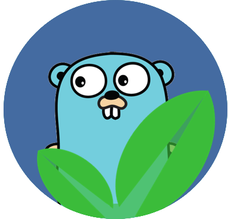

  
  <h3 align="center">hrple</h3>
  
Create a hrple of habits

---

**`hrple`** is an easy to use tool to help you create habits. This is loosely inspired by the book *Atomic Habits* by *James Clear* and techniques or frameworks like *Kanban* and the *Pomodoro Technique*.

---

## Project Rationale

- To **create** something useful to me and hopefully other people
- To **learn**! While I could use some really awesome go modules/libraries provided by the community, I have chosen to implement my own light weight versions by using as much of the `std lib` as possible. See the [Giving Thanks](#giving-thanks) and [Experiments](#experiments) sections.

---

## Project Milestones

A not so long list of milestones, just something to work towards.

- [ ] **v1** - To manage "*habits*" via the `cli` and `grpc` (***current milestone***)
  - [ ] :construction: Implement own light weight `pkg/cli` lib
    - [x] add base commands for cli i.e. `mycli subCommand`
    - [x] add args for command i.e. `mycli subCommand arg1 arg2`
    - [ ] :construction: add flag for command i.e. `mycli subCommand arg1 arg2 --help -v`
  - [ ] Central `proto` definition repo
    - [ ] :memo: Duplicate known types or use compiled format as it should be backwards compatible
  - [ ] Implement Server component
    - [ ] auth
      - [ ] auth
      - [ ] registration
      - [ ] profile (modify)
    - [ ] api-gateway      
    - [ ] Habit Tracker
      - [ ] Add/Modify
      - [ ] History
      - [ ] Pause
      - [ ] Track (Did you do it? How did it feel? Rate it? Share it?)
- [ ] **v1.1** - Android App
- [ ] **v1.2** - IOS App
- [ ] **v1.3** - Windows App
- [ ] **v1.4** - Desktop App

---

## Technology

Below is a list of the technology primarily used in this project.

### Backend

- Go (aka golang)
- GRPC, REST, GQL
- K8s & Docker

### FrontEnd

- Flutter & Dart

## Project Structure

Below is a brief description of the project folder structure.

### `/cmd`

Contains the main executeable applications, namely `cli`

### `/internal`

Contains all the private code for this application to work.

### `/package`

Contains all libs/modules which may be shared i.e. `cli`.

### `/scripts`

Scripts to perform various tasks such as `build` or `sca` (static code analysis), etc. This allows us to keep our makefile in the root folder small.

## Project Setup

Below is a brief description of how to setup this project.

### BootStrap

The tools listed below are required for the build and/or packaging process.

| Category | Description | URL |
|---|---|---|
| Linter | `golangci` is our linter of choice | https://golangci-lint.run |
|   |   |   |

# Giving Thanks

A Big Shout Out! To the people who worked on the following, the work you have done has aided in my learning of the go language and eco-system. 

- project layout inspired by <https://github.com/golang-standards/project-layout>
- linting from <https://golangci-lint.run>
- `pkg/cli` inspired by <https://github.com/spf13/cobra>
- project logo inspired by my horrific graphic design and created with <https://krita.org/en/>

# Other

## Emoji Legend

| meaning | emoji | text |
| ------- | ----- | ---- |
| done | :heavy_check_mark: | `:heavy_check_mark:` |
| wip | :construction: | `:construction:` |
| note | :memo: | `:memo:` |

## Experiments

- proto <https://github.com/brettmostert/trple-proto>, experimented with
  - mono repository for proto defintions
  - generate defintions for multiple languages using buf and the standard grpc libs provided
  - scripted commit of go proto definitons <https://github.com/brettmostert/trple-proto-product-go>
- grpc <https://github.com/brettmostert/trple>, experimented with
  - using generated proto definitions from mono repo for repo
